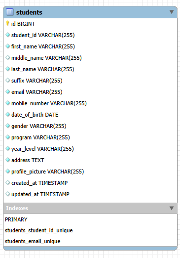
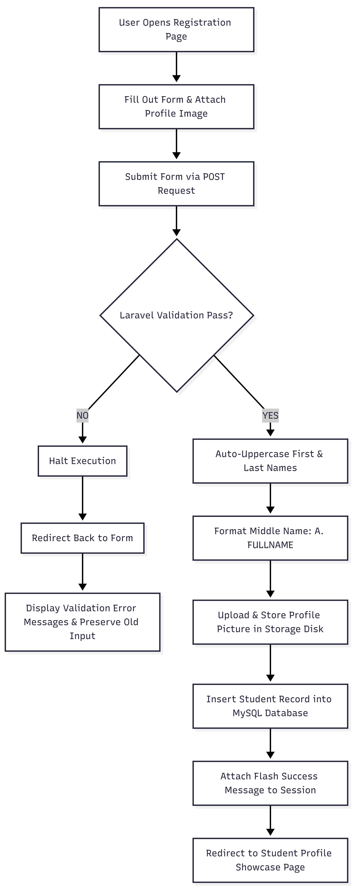

# ITST 302 — Student Registration System using Laravel

## 1. Project Title

**Student Registration System with Laravel Forms, Validation, and File Upload**

**Subject:** ITST 302 — Client-Server Technologies  
**Project:** Mini Project 03: Student Registration System with Laravel Forms, Validation, and File Upload  
**Course:** Bachelor of Science in Information Technology (BSIT)  

---

## 2. Introduction

### What is a Student Registration System?

A Student Registration System is a web-based application built to digitize and automate the student onboarding process. Developed using Laravel, MySQL, and Tailwind CSS, this application enables students to submit their personal, contact, and academic details, upload an official profile picture, and securely store validated information into a relational database.

### Purpose of a Student Registration System

The primary purpose of a Student Registration System is to replace paper-based registration workflows with a secure digital platform. By automating data collection, the system eliminates manual data entry errors, streamlines administrative processing, and ensures that student information is instantly normalized, organized, and accessible through dynamic profile views.

### Importance of Data Validation

Data validation is critical for maintaining application security, database integrity, and user experience:

* **Data Consistency & Standardization**: Enforces uniform formats across all database fields, such as auto-uppercasing student names, converting full middle names into standard initial format `A. (AGOJO)`, and restricting mobile numbers strictly to a 12-digit numeric constraint.
* **Prevention of Duplicate Entries**: Protects primary identification fields like `student_id` and `email` using database unique constraints to prevent accidental duplicate registrations.
* **File Upload Security**: Restricts profile picture uploads to supported image formats (`.jpg`, `.jpeg`, `.png`) with a 2 MB size ceiling, preventing unauthorized script execution and preserving server storage.
* **Error Prevention**: Catches invalid or missing user input at the server layer before reaching the MySQL layer, preventing system crashes and runtime SQL exceptions.

### Role of Registration Systems in Enterprise Applications

In enterprise application architecture, registration systems serve as the core entry point for identity management and user onboarding:

* **Central Point of Data Intake**: Foundational across multiple enterprise domains, including academic portals (student enrollment), corporate HR suites (employee onboarding), healthcare systems (patient registration), and banking platforms (KYC registration).
* **Enterprise Module Integration**: Feeds validated identity records into downstream organizational modules such as authentication systems, access control, billing, course scheduling, and analytics.
* **Regulatory & Audit Compliance**: Ensures that all collected data adheres strictly to organizational business logic, database structural standards, and privacy requirements right from the moment of intake.

---

## 3. Objectives

The primary objectives of this project are:

* Develop a responsive, modern student registration interface using Laravel Blade templates and Tailwind CSS.
* Process client HTTP requests using dedicated methods in `StudentController`.
* Implement robust server-side validation rules and data transformation logic (auto-uppercasing, custom middle name formatting, and 12-digit mobile constraints).
* Prevent duplicate entries using unique validation constraints on primary identifiers such as Student ID and Email.
* Process, validate, and securely store student profile pictures using Laravel Storage and public disk symbolic linking.
* Display dynamic field-level validation errors and flash notifications upon successful form submission.
* Format and store structured student records into a relational MySQL database schema.
* Display registered student details through a dynamic student profile view and a centralized student directory page.
* Understand and apply the Laravel Request Lifecycle during form submission and file handling.
* Apply version control practices using Git and GitHub following Conventional Commits.
* Document the complete software development process following enterprise documentation standards.

---

## 4. Laravel Request Lifecycle

The student registration process strictly follows the Laravel Request Lifecycle to handle HTTP requests, process input data, execute transformations, and return responses:

```text
Browser (User Submits Form)
          ↓
     Route (routes/web.php)
          ↓
  Controller (StudentController@store)
          ↓
Validation ($request->validate())
          ↓
    Model (Student::create())
          ↓
  Database (MySQL Insertion)
          ↓
   Response (Redirect with Flash)
          ↓
Browser (Renders Profile View)
```
### Process Explanation

1. **Browser**: The student completes the online registration form and submits it via an HTTP `POST` request to `/students`.
2. **Route**: The Laravel router (`routes/web.php`) intercepts the incoming `POST` request and delegates execution to `StudentController@store`.
3. **Controller**: The `StudentController` receives the incoming `Illuminate\Http\Request` object containing form inputs, dropdown selections, and the uploaded file payload.
4. **Validation**: The `$request->validate()` method executes server-side validation. If validation fails, Laravel interrupts execution and automatically redirects back to the form with saved input data and field error messages.
5. **Data Transformation & Model**: Upon validation success, name fields are transformed to uppercase, full middle names are formatted to `A. (FULLNAME)` format, and uploaded images are saved to `storage/app/public/profile_pictures`. The `Student` Eloquent model receives the sanitized payload array.
6. **Database**: The Eloquent ORM translates the model operation into a SQL `INSERT` query, writing the record to the `students` table in the MySQL database.
7. **Response**: The controller issues an HTTP redirect response to the student profile route (`students.show`), attaching a success session flash message (`Student registered successfully!`).
8. **Browser**: The client browser receives the redirect response, fetches the profile view, and renders the registered student details along with their uploaded profile picture.

---

## 5. Validation Rules

The Student Registration System enforces server-side validation using Laravel's built-in validation engine prior to processing database operations or storing uploaded files.

### Validation Matrix

| Field | Rule / Constraint | Description & Purpose |
| :--- | :--- | :--- |
| `student_id` | `required\|unique:students,student_id` | Prevents blank submissions and ensures no two students share the same institutional identification number. |
| `first_name` | `required\|string\|max:100` | Ensures student first name is present, textual, and strictly under 100 characters. |
| `middle_name` | `nullable\|string\|min:2\|max:100\|regex:/^[a-zA-Z\s]{2,}$/` | Optional field. Enforces a 2-character minimum and regex string check to reject single-letter initials (e.g., "A" or "A.") in favor of full middle names. |
| `last_name` | `required\|string\|max:100` | Requires student surname input within standard length constraints. |
| `suffix` | `nullable\|string\|max:10` | Optional selection (`JR.`, `SR.`, `I` – `VI`) to capture generational suffixes accurately. |
| `email` | `required\|email\|unique:students,email` | Validates standard RFC email syntax and prevents duplicate account registration under the same email address. |
| `mobile_number` | `required\|numeric\|digits_between:1,12` | Guarantees numeric-only input and limits total digits strictly to a maximum of 12 numbers. |
| `date_of_birth` | `required\|date` | Validates that the input adheres to a valid calendar date format. |
| `gender` | `required` | Ensures a gender selection is recorded from the form drop-down list. |
| `program` | `required` | Captures the enrolled degree program. |
| `year_level` | `required` | Captures academic year level (`1st Year` to `4th Year`). |
| `address` | `required\|string` | Collects complete physical residential location information. |
| `profile_picture` | `required\|image\|mimes:jpg,jpeg,png\|max:2048` | Restricts upload files strictly to valid image formats (`.jpg`, `.jpeg`, `.png`) with a maximum allowed file size of 2048 KB (2 MB). |

---

### Importance of Validation Rules

* **Required Field Validation**: Ensures completeness of student personnel files by rejecting incomplete web forms before SQL execution.
* **Unique Constraints**: Prevents data corruption and identity duplication across core system identifiers (`student_id` and `email`).
* **Format & Pattern Validation**: Enforces institutional naming rules (such as full middle name input over single initials) and clean digit-only phone records.
* **File Upload Constraints**: Protects application storage space, guards against malicious non-image file uploads (e.g., `.php` or executable scripts), and maintains web rendering performance.

---

## 6. Database Design

The system relies on a MySQL relational database named `week04_student_registration` with a single primary table named `students`.

### Table Schema: `students`

| Column | Data Type | Key / Constraint | Nullable | Description |
| :--- | :--- | :--- | :--- | :--- |
| `id` | `BIGINT` | Primary Key, Auto Increment | No | Unique internal database record ID |
| `student_id` | `VARCHAR(255)` | Unique Index | No | Official student identification number |
| `first_name` | `VARCHAR(255)` | None | No | Student first name (stored in uppercase) |
| `middle_name` | `VARCHAR(255)` | None | Yes | Formatted middle name: `INITIAL. (FULLNAME)` |
| `last_name` | `VARCHAR(255)` | None | No | Student surname (stored in uppercase) |
| `suffix` | `VARCHAR(255)` | None | Yes | Generational name suffix (e.g., `JR.`, `III`) |
| `email` | `VARCHAR(255)` | Unique Index | No | Student email address |
| `mobile_number` | `VARCHAR(255)` | None | No | Numeric mobile number (max 12 digits) |
| `date_of_birth` | `DATE` | None | No | Birth date record |
| `gender` | `VARCHAR(255)` | None | No | Gender identity classification |
| `program` | `VARCHAR(255)` | None | No | Degree program / Academic major |
| `year_level` | `VARCHAR(255)` | None | No | Enrolled academic year |
| `address` | `TEXT` | None | No | Full residential address details |
| `profile_picture` | `VARCHAR(255)` | None | No | Public storage file path string for image |
| `created_at` | `TIMESTAMP` | None | Yes | Timestamp when the record was created |
| `updated_at` | `TIMESTAMP` | None | Yes | Timestamp when the record was last modified |

---

### Primary Key & Unique Constraints

* **Primary Key**: `id` serves as the surrogate primary key for unique row identification.
* **Unique Key 1**: `student_id` is indexed as unique to ensure institutional ID integrity.
* **Unique Key 2**: `email` is indexed as unique to prevent duplicate user account creation.

---

### Entity Relationship Diagram (ERD)



---

## 7. Registration Flowchart

The student registration process models the conditional execution logic enforced by Laravel upon form submission. The application validates input integrity, executes data normalization, handles profile image uploads, creates database records, and routes the user accordingly.

### Process Flow

```text
User Opens Registration Page
          ↓
     Fill Out Form
          ↓
   Submit Registration
          ↓
   Laravel Validation
          ↓
      Valid Data?
       ↙       ↘
     NO         YES
     ↓           ↓
Display Errors  Format Names & Upload Profile
                 ↓
           Save to Database
                 ↓
          Success Message
                 ↓
        Student Profile Page
```

### Flowchart 



---
